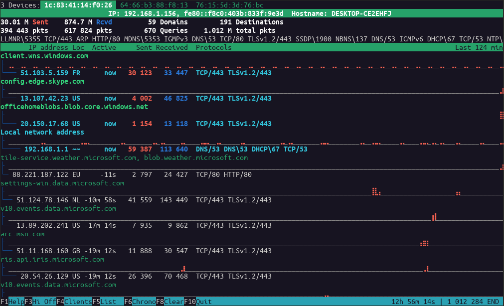

# wireowl

Interactive terminal app showing statistics and visualisation of network communication in real-time or from saved pcap/pcapng file.

<br>



-----

## Purpose

Get a quick overview of network/internet communication.

Find out where app or device is communicating to while busy or idle.

Watch saved pcap/pcapng captures in any speed.

Monitor or audit any kind of wireless device and watch its network activity in real-time. See [EduRouter](https://github.com/rozvara/EduRouter.git) project.

## Features

wireowl shows for every device (MAC address in network traffic):
* statistics
* list of connections/endpoints (IP address, country, DNS names, statistics...)
* outgoing protocols/ports per endpoint
* visual overview of outgoing/incoming traffic per endpoint (per second or minute)
* additional information such as device hostname, it's mDNS queries

-----

## Installation

### 1. Install dependencies

#### Debian GNU/Linux, Ubuntu

```
sudo apt install git python3 tshark geoip-bin
```

Opt for "non-superusers able to capture packets" during tshark installation. If you don't, you can do it later by `sudo dpkg-reconfigure wireshark-common`.

#### Fedora

```
sudo dnf install git python3 wireshark-cli GeoIP
sudo usermod -a -G wireshark $USER
```

#### Others

You need `python3`, `tshark` (from wireshark.org) and optionally `geoiplookup` and `geoiplookup6` (without them location of endpoints will not be shown). Please note that python-geoip is [broken/unmaintained](https://github.com/mitsuhiko/python-geoip/issues/14), that's why maintained packages with offline databases are used for geolocation.

### 2. Install/update wireowl

```
cd /tmp
git clone https://github.com/rozvara/wireowl.git
cd wireowl
source install.sh
```

### 3. Logout and login

You need to logout and login to be able to capture network traffic as a regular user. (Since you need to be logged as member of wireshark group.)

## Usage

To view what's going on on the local interface:
```
wireowl
```
To use it as a "pcap-player" and watch simulation of saved capture in real-time speed:
```
wireowl --speed 1 --read-file /path/to/filename.pcap
```
For short/all options use:
```
wireowl -h
```

For keyboard shortcuts press F1 in the app.

-----

## Roadmap

In no particular order the future development is about:

- [ ] Highlighting indicators of compromise (known spyware/malware IPs/Domains)
- [ ] Adding sort of unattended kiosk mode
- [ ] Improving sorting options (volume, domains...)
- [ ] Adding searching and filtering

## Modifications

To play with the code or contribute, clone repo and from src/ folder run `./wireowl` (wireowl.py located in the current folder will be used).

To run app without tshark in background while debugging, you may prefer `python3 wireowl.py [options] tab-delimited.csv`. See `-p` parameter.

ui.debug might be your friend.
